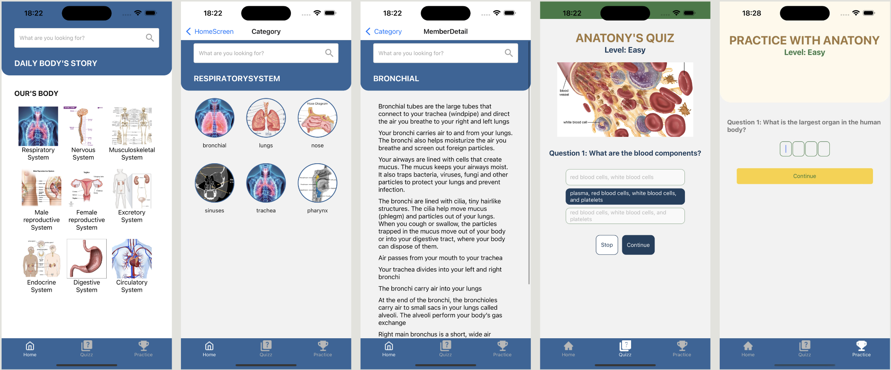

# Human Anatomy - Understanding the Human Body

## Description:
The Human Anatomy app is designed to educate users about the functions and systems of the human body. It provides a comprehensive learning experience through detailed lessons, instructional videos, and interactive quizzes.

The app is compatible with both iOS and Android devices.

**Main Features:**
- The app focuses primarily on quizzes and practice exercises, allowing users to review and reinforce their knowledge of human anatomy.
- Users can engage with quizzes that test their understanding of various systems of the human body.
- Practice sessions are designed to help users solidify their learning and track their progress over time.

## Technologies Used:
* [React Native:](https://reactnative.dev/) A framework that supports building cross-platform mobile applications, ensuring a seamless experience on both iOS and Android devices.
* [Redux Toolkit:](https://redux-toolkit.js.org/) A library that efficiently manages the application’s state, allowing for easy scalability and maintenance of the app's complex state logic.
* [nativewind:](https://nativewind.dev/) A utility-first CSS framework for React Native, enabling rapid styling and design of the app's user interface.
* [expo-router:](https://expo.dev/router) A routing library for Expo applications that simplifies navigation and URL handling, making it easier to manage app screens and deep linking.

## [Installation](https://drive.google.com/file/d/1InLIHxG_A2SMXYC8bMfvmKvZ0uMRdXOm/view?usp=sharing/)

## Demo
# human-anatomy
